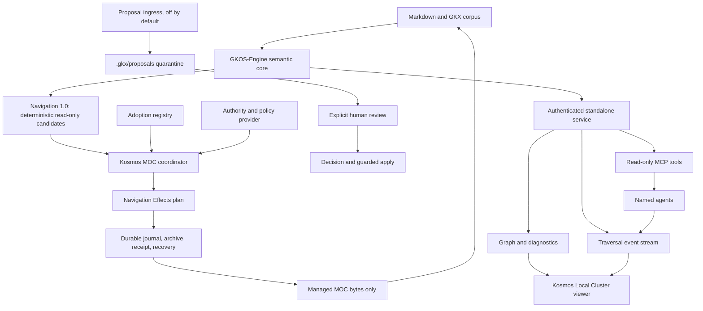

# Kosmos-Oden Standalone Engine, Local Cluster, and Managed MOC Uplift

## Junior Implementation and Build Plan

**Date:** 2026-08-26
**Revision:** 2 — adds the opt-in Navigation Effects managed-MOC integration
**Status:** Implementation handoff; no merge, release, deployment, or authority activation is authorized by this document
**Target product:** Kosmos-Oden Standalone
**Target platforms:** Debian 13 desktop and headless server, Windows 11 x64, macOS 14+ arm64 and x64
**Current semantic oracle:** GKOS-Engine TypeScript 2.1.2
**Long-term engine destination:** GKOS-Engine Full Rust 3.0, with Lite 2.x built from the same Rust core

---

## 1. Plain-language objective

Deliver Kosmos-Oden as a first-class application that does not require Obsidian:

1. Run GKOS-Engine as an independent local or headless service.
2. Preserve the existing offline Local Cluster of Galaxies visual instead of rebuilding it.
3. Give the standalone viewer a real authenticated connection to graph, MCP, and traversal-event services.
4. Integrate the separately versioned Navigation Effects plane so explicitly adopted managed MOCs can converge after live events and missed-event recovery.
5. Preserve every existing read-only workflow for users who do not explicitly enable and authorize MOC writes.
6. Add safe proposal review, traffic observability, and session replay without allowing model confidence to become authority.
7. Package and test the result for Debian, Windows, and macOS.
8. Keep the TypeScript implementation as the compatibility oracle until the ratified Rust 3.0 replacement passes all parity and cutover gates.

This is primarily a separation, service, packaging, and integration project. It is not a new knowledge engine and must not create a second interpretation of GKX.

---

## 2. Verified repository state

This plan was prepared from live clones of both repositories on 2026-08-26.

| Repository | Verified branch and commit | Declared version | Important finding |
| --- | --- | ---: | --- |
| `Odenknight/Kosmos-Oden` | `main@a7113c0ca3be8dd230a9549940e2f387d4cb2a96` | 0.8.0 | Already contains the offline single-file Local Cluster viewer and a loopback graph feed |
| `Odenknight/GKOS-Engine` | `main@2fbd4ec68ec825b09e5194c9878a7ae90a281392` | 2.1.2 | Already contains a headless loopback REST sidecar and Node SEA build path |
| Kosmos engine dependency | pinned to `GKOS-Engine#v2.1.1` / commit `f4dfda1…` | 2.1.1 | Consumer pin is behind Engine `main` 2.1.2 |
| Latest Engine tag visible | `v2.1.1` | 2.1.1 | Engine 2.1.2 exists on `main` but is not represented by a visible `v2.1.2` tag in this snapshot |

Important Engine work also exists on unmerged remote branches. Do not pretend `main` contains all current engineering:

| Candidate branch | Verified head | Relevance |
| --- | --- | --- |
| `codex/phase-0-recon-adrs` | `ba918e6617ece6bb1392f6768b69d4913818035d` | Compatibility oracle fixtures and architectural decisions |
| `codex/phase-1-retrieval-core` | `0164f3d5b2c698cbf048c8e0e53323def80eb251` | Retrieval core and contracts |
| `codex/phase-5-watcher-recovery` | `7b5262baee9fcda23d50b0cee0c4977d6e4305e7` | Watcher, recovery, ingest, retrieval, and authorized-view work |
| `codex/navigation-effects-post-phase5` | `808d875b557f4cfd2bb0addccba44d70c9748f35` | Navigation Effects 1.0 integration contract plus experimental Node planner/executor, journal, archive, receipt, rollback, and recovery work; also includes frontmatter correction commit `95b104e59fe0b322659450a244bea8ac9c94bf72` |
| `codex/phase6-f1-contract-pack` | `e29e04bdad1cd192a25eba2d682a4c46774def28` | Draft identity and MCP contract pack; contract-only, not activated runtime authority |

### Verification evidence

The Engine repository records a successful 2.1.2 verification run at implementation commit `0545f92…`: 245 tests, 244 pass, 0 fail, and one explicit external-fixture skip. Treat that as repository evidence, not as a fresh execution result for every later branch.

The DeepSeek statement that both repositories were freshly executed on Node 22.22.2 could not be corroborated from the checked-in repository evidence. The preparation workspace could clone and inspect both repositories but could not complete `npm ci` because its npm dependency cache path was environment-restricted. Therefore the executor must rerun every baseline command on a normal build host and record the actual TAP summaries. Never weaken a gate because the count differs from an old README.

### Navigation Effects evidence and standing

The inspected effects branch exports `gkos-engine/navigation-effects` and `gkos-engine/navigation-effects/node`. Its contract manifest identifies:

- suite `ENGINE-NAV-EFFECTS-CONTRACT-1.0.0`;
- Engine release target `2.2.0`;
- Navigation contract `1.0.0` and Navigation Effects contract `1.0.0`;
- standing `integration-only`;
- implementation phase `node-executor-experimental`;
- GKOS conformance `false`;
- source-content effects available only through an explicit host adapter.

The branch already contains substantial reusable mechanisms: deterministic MOC planning; ownership and marker validation; fail-closed path policy; scoped locks; a vault lease; exact before/after archives; temporary same-directory writes; digest rechecks; hash-chained journal entries; checkpoints; receipts; rollback plans; startup recovery classifications; and an experimental Node executor. Kosmos must consume and qualify these mechanisms, not create a competing transaction protocol. This evidence is not a released Engine 2.2 artifact and must never be described as production compatibility.

---

## 3. DeepSeek report adjudication

| DeepSeek claim or recommendation | Verdict | Required correction |
| --- | --- | --- |
| Build a standalone Local Cluster viewer | Already implemented | Rebuild and ship `kosmos-oden-stand-alone.html`; do not create a second renderer |
| Separate the engine from Obsidian | Mostly implemented | GKOS-Engine is already separate; finish the standalone service and distribution boundary |
| Per-agent color coding is already present | Substantially correct | Trails, dust, rockets, and labels use stable per-agent colors; the short-lived node halo remains common emerald |
| Add a fuel heatmap | Rename and constrain | Current events do not carry fuel or cost. Build a traffic heatmap. Add a fuel/cost overlay only after the event contract carries real cost units |
| Add agent session replay | Valid | Add a bounded event recorder and deterministic replay driven by an injected clock |
| Add confidence-based auto-approval | Not authorized | Confidence remains evidence for triage, never approval. Build sorting/filtering and explicit batch review only. Auto-approval is a separate owner/governance decision |
| Add `#agent-suggestions` or arbitrary JSONL queue | Wrong canonical location | Use the reserved `.gkx/proposals/<proposal-id>.yaml` and `.gkx/decisions/<decision-id>.yaml` boundaries and existing proposal envelopes |
| Add a read-only-to-safe-write `POST /proposals` | Misclassified | Proposal ingress is a write effect. It must be opt-in, credential-scoped, durable, atomic, audited, and unable to modify source notes |
| Add real-time automatic MOC maintenance | Valid only through Navigation Effects | Keep Navigation 1.0 pure. Existing MOCs require digest-bound adoption, and automatic writes stay off until adapter, authority, policy, journal, recovery, and reconciliation are all safe |
| The standalone viewer can use 4814 while MCP queries on 4816 draw trails | False | Port 4814 currently has REST graph data but no MCP or event stream. Port 4816 belongs to the Obsidian-hosted Agent API. Build a unified standalone service path |
| Put the bearer token in `?token=` | Existing behavior, but unsuitable for the new package | Deprecate query-token launch. Use the in-page password field or secure desktop-shell IPC; tokens must not enter history, logs, shortcuts, or process arguments |
| The token is copied into the status JSON | False | The current status document exposes `token_path`, not the token value. Preserve that separation and harden file permissions |
| Use `socat` in Docker to bridge the loopback guard | Reject | It bypasses the intended bind boundary and exposes a container-network listener. On Debian, use host networking so 127.0.0.1 remains host loopback |
| Mount the Docker vault read-only and use the default status path | Will fail | The current sidecar writes status and token beside the status file. Pass `--status-file /state/desktop-agent.status.json` and mount `/state` writable |
| Exact test count is always 244 | Too brittle | Require zero failures and only documented skips; record counts at the exact tested SHA |

---

## 4. Controlling architecture



### Ownership rules

| Component | Owns | Must not own |
| --- | --- | --- |
| GKOS-Engine | Parsing, validation, assessment, canonicalization, lineage, temporal projection, graph, filtering, protocol contracts | Kosmos visuals or Obsidian APIs |
| Navigation Effects contract | Deterministic effect plans, ownership and marker rules, authority/policy bindings, receipts, archive and recovery contracts | Inferring authority or turning Navigation 1.0 into a writer |
| Standalone service adapter | Filesystem scan/watch, local authentication, REST/MCP/event transport, proposal quarantine adapter | New GKX meaning or a second parser |
| Kosmos-Oden | Local Cluster cosmology, layout, shaders, controls, visual observability, Obsidian event delivery, settings/UI, effect host adapter, coordination and reconciliation | Authoritative validation, alternate graph semantics, or self-invented effect semantics |
| Desktop shell | Sidecar lifecycle, secure token handoff, platform packaging, logs and update UX | Knowledge semantics or approval authority |
| `.gkx/` sidecars | Proposals, decisions, diagnostics, policy/schema packages and caches under defined contracts | Silent source-note replacement or hidden approvals |

### Product naming rule

Call the deliverable **Kosmos-Oden Standalone**. Do not rename it GKOS-Engine-Lite. Lite 2.x has its own ratified Rust profile and must not become a packaging alias for the full Kosmos visualization product.

---

## 5. Non-negotiable invariants

1. GKX remains canonical. Retrieval indexes, Graphiti, heatmaps, replays, and Local Cluster layouts are projections.
2. `proposed` never becomes `effective` without a valid external authority decision.
3. A model or agent cannot approve its own proposal.
4. Confidence is represented as `0.0..1.0`; do not introduce a second `0..100` canonical form.
5. Sensitivity is fail closed and raise only. Missing or invalid data must never become more visible.
6. Every externally returned graph, note, edge, episode, search result, and traversal event must be filtered through one authorized view before serialization.
7. No query-string tokens in the completed packaged application.
8. Local default means loopback. Do not add `--host`, bind to `0.0.0.0`, or use a proxy to evade the guard.
9. Each MCP agent has a stable credential-bound identity, its own limits, sensitivity ceiling, revocation state, and audit identity.
10. Generated agent notes default to `_kosmos/agent-notes/<agent-slug>/`. Proposals use `.gkx/proposals/`. Do not merge these concepts.
11. Keep the TypeScript 2.1.2 outputs as the compatibility oracle until Rust 3.0 passes the cutover gates.
12. Do not merge to `main`, tag, publish, sign, notarize, deploy, or activate new write authority without explicit owner authorization.
13. Navigation 1.0 remains pure and continues to advertise `apply_moc: false`; all MOC writes belong to the separately configured Navigation Effects plane.
14. Automatic MOC writing and automatic MOC creation are disabled by default and remain unavailable until capability, authority, policy, journal, recovery, and reconciliation gates all pass.
15. Existing human MOCs are never overwritten automatically. They require explicit digest-bound adoption as region-managed or fully managed.
16. Region-managed writes replace only one valid versioned generated region and preserve every byte outside it, including original line endings.
17. Missing, duplicated, nested, malformed, moved, configuration-mismatched, or externally changed markers fail closed.
18. `.gkx/**` and `_archive/moc-runs/**` never enter Navigation, retrieval, graph, Graphiti, or agent context.
19. MCP connectivity, bearer-token possession, client name, model confidence, and timestamps never supply write authority.
20. No write may lower sensitivity, escape its authorized vault-relative path, traverse a symlink/junction/reparse point, or delete source notes or archives.

---

## 6. Required implementation sequence

Do the phases in order. Each phase ends with a gate. If a gate fails, stop and report the exact command, SHA, error, and changed files.

### Phase 0 — Reconcile authority and establish clean baselines

#### 0.1 Clone and record exact state

```bash
git clone https://github.com/Odenknight/GKOS-Engine.git
git clone https://github.com/Odenknight/Kosmos-Oden.git

cd GKOS-Engine
git fetch --all --tags --prune
git status --short --branch
git rev-parse HEAD
git tag --points-at HEAD

cd ../Kosmos-Oden
git fetch --all --tags --prune
git status --short --branch
git rev-parse HEAD
git tag --points-at HEAD
```

Create `docs/standalone/BASELINE.md` in the implementation branch and record:

- repository and commit SHA;
- branch and tag;
- Node, npm, Rust, Cargo, OS, and architecture;
- dependency lock hashes;
- exact commands and TAP summaries;
- all skips and why they are allowed;
- whether the working tree was clean before and after.

#### 0.2 Inventory the uplift branches before coding

Do not reimplement the frontmatter fix. Commit `95b104e59fe0b322659450a244bea8ac9c94bf72` already bounds Navigation frontmatter parsing on the effects branch. Compare it against the chosen integration base and either preserve it through reconciliation or document why it cannot be used.

Create a draft integration branch without changing `main`:

```bash
cd GKOS-Engine
git switch --create integration/kosmos-standalone-20260826 origin/codex/phase6-f1-contract-pack

cd ../Kosmos-Oden
git switch --create feature/navigation-effects-moc-coordinator main
```

Before either switch, inspect `git status --short --branch`, remotes, and worktrees. If unrelated changes exist, preserve them in place and create a separate clean worktree for this build. Do not stash, reset, overwrite, or absorb pre-existing user changes into the feature branch.

This is the recommended integration baseline because it retains the latest visible contract work while leaving `main` untouched. It does **not** authorize those contracts for production. The 2.1.2 compatibility fixtures remain the oracle.

If the Phase 6 branch cannot pass its own checked-in gates, stop. Do not silently fall back to `main` and duplicate the missing work.

#### 0.3 Run baselines

```bash
cd GKOS-Engine
npm ci
npm run typecheck
npm run build
npm test
npm run test:navigation
npm run test:intelligence
npm run pack:check
npm run check:license
npm run check:nomenclature
git diff --check

cd ../Kosmos-Oden
npm ci
npm run verify
npm run test:renderer
git diff --check
```

Do not hard-code old pass totals. Pass means zero failures and no unexplained skip.

#### Gate P0

- Both implementation worktrees were clean before changes, and any pre-existing changes in other worktrees remain untouched.
- All repository gates pass.
- All relevant remote branches and exact SHAs are recorded.
- The 2.1.2 compatibility fixture suite passes from the integration branch.
- No source change has been made yet.

---

### Phase 1 — Correct and formalize the standalone engine service

The goal is one transport-neutral service implementation used by the native sidecar and, later, the Obsidian adapter. Do not copy the Kosmos Agent API into a second permanent server.

#### 1.1 Create a service module in GKOS-Engine

Recommended paths:

```text
src/service/
  authorized-view.ts
  capabilities.ts
  corpus-provider.ts
  events.ts
  mcp.ts
  rest.ts
  server.ts
  types.ts
contracts/service/GKOS-LOCAL-SERVICE-1.0.0-draft.1/
test/service-*.test.mjs
```

Add a package export such as `gkos-engine/service`. The service consumes the public Engine core. It does not parse or reinterpret frontmatter itself.

`CorpusProvider` must provide normalized source records, attachments, graph state, content lookup, change notifications, and configured authorization data. The Node filesystem adapter and Kosmos Obsidian adapter implement this interface.

#### 1.2 Build one authorized view

The current `src/desktop-agent.ts` serializes all projected notes, the full graph, and all Graphiti episodes after merely labeling sensitivity. Replace that with one `buildAuthorizedView()` path used by every endpoint.

The view must:

- accept credential identity, ceiling, corpus, operation, and evaluation time;
- remove notes above the credential ceiling before output construction;
- remove edges whose source or target was removed;
- omit attachments and derived counts that would reveal filtered notes;
- construct Graphiti episodes only from visible nodes;
- return honest visible counts and separate internal indexing health that is never exposed to unauthorized identities;
- fail closed when sensitivity, identity, policy, or authorization is invalid or unavailable.

Required negative tests:

- a `secret` note title, path, UID, body fragment, edge, attachment, diagnostic, or count cannot be found in response bytes at an `internal` ceiling;
- an edge to one hidden endpoint is absent;
- an episode derived from a hidden note is absent;
- two responses over unchanged authorized state are byte identical;
- unauthorized and revoked credentials return governed denials without partial payloads.

#### 1.3 Preserve the frontmatter boundary correction

The current `main` CLI helper `frontmatterValue()` searches the entire note and can read `sensitivity:` from a fenced code example. Reconcile commit `95b104e59fe0b322659450a244bea8ac9c94bf72` or replace the helper with the Engine's existing bounded parser. There must be exactly one parsing authority.

Regression fixture:

````markdown
# Example

```yaml
sensitivity: public
```
````

The note has no leading frontmatter and must fail closed. It must not enter a public context pack.

#### 1.4 Define the unified local protocol

Use port 4814 for the standalone service by default:

| Method and route | Purpose | Default |
| --- | --- | --- |
| `GET /health` | Process and protocol health with safe visible counts | Enabled, authenticated |
| `GET /capabilities` | Truthful feature and authority boundary | Enabled, authenticated |
| `GET /notes` | Authorized note summaries | Enabled |
| `GET /graph` | Authorized graph | Enabled |
| `GET /graphiti/episodes` | Authorized paginated projection | Enabled |
| `GET`, `POST`, and `DELETE /mcp` | Streamable HTTP MCP lifecycle | Enabled only after identity contract runtime gates pass |
| `GET /events` | Authenticated fetch-stream traversal events | Enabled with viewer credential |
| `POST /proposals` | Proposal quarantine ingress | Disabled by default; Phase 2 only |

Keep Kosmos's existing 4816 Obsidian API as a compatibility surface during migration. Do not tell users to split one standalone session across 4814 and 4816.

#### 1.5 Implement read-only MCP

Reuse the seven read-only tools defined by the Phase 6 F1 contract pack. Do not activate the 16 deferred surfaces merely because schemas exist.

Requirements:

- Streamable HTTP protocol and lifecycle validation;
- stdio adapter remains available for clients that cannot send HTTP headers;
- per-agent credential-bound identity;
- request byte cap, result cap, concurrency cap, rate limit, and revocation;
- tool declarations truthfully marked read-only and idempotent where applicable;
- traversal events contain only paths the same credential was authorized to see;
- an MCP result and its event are derived from the same authorized view and operation ID.

#### 1.6 Add a real traversal event stream

Use authenticated `fetch()` streaming so the viewer can send an `Authorization` header. Do not use native `EventSource`, because it cannot reliably send the bearer header, and do not put a token in the URL.

Minimum event envelope:

```json
{
  "schema_version": 1,
  "session_id": "opaque-session-id",
  "sequence": 42,
  "offset_ms": 1832,
  "operation_id": "opaque-operation-id",
  "agent_id": "stable-agent-id",
  "agent_label": "Alpha",
  "tool": "search_notes",
  "paths": ["Guides/Torpedoes.md"],
  "status": "completed",
  "cost_units": null
}
```

`cost_units` stays `null` unless a real metering source exists. Events must never carry note bodies, tokens, credentials, hidden paths, model prompts, or raw errors containing secrets.

The server keeps a bounded in-memory ring. Reconnect uses the last acknowledged sequence where possible. Event persistence is off by default.

#### Gate P1

- The sidecar offers graph, read-only MCP, and event stream on one authenticated loopback service.
- All routes use one authorized view.
- The frontmatter fence regression passes.
- No token appears in URL, logs, status JSON, process list, test snapshots, or error bodies.
- Existing 2.1.2 compatibility outputs remain unchanged for the same authorized inputs.

---

### Phase 2 — Safe confidence triage and agent proposal queue

#### 2.1 Implement confidence-assisted review, not auto-approval

In Kosmos-Oden's enrichment review surface:

- sort by confidence descending or ascending;
- filter by field, source, confidence range, conflict status, and agent;
- show an explicit confidence explanation and evidence links;
- add **Select candidates at or above threshold**, not **Auto approve**;
- require a visible batch preview before a human marks a batch accepted;
- preserve the final acknowledgement that confidence approved nothing automatically;
- keep authority-denylisted fields unavailable to bulk operations.

Fields such as approval state, effective state, UID, sensitivity lowering, epistemic promotion, operational authorization, and authoritative lineage must never be selected by a confidence threshold.

Do not add a disabled auto-approval policy object as speculative code. That creates an untested authority path. Auto-approval requires a separately ratified contract, threat model, allowed-field definition, audit semantics, revocation behavior, and owner authorization.

#### 2.2 Implement immutable proposal quarantine

Use the existing reserved layout:

```text
.gkx/proposals/<proposal-id>.yaml
.gkx/decisions/<decision-id>.yaml
```

Each proposal must bind:

- schema and contract version;
- proposal ID;
- credential-bound agent ID;
- target UID and normalized path;
- target source-byte SHA-256;
- field and canonical proposed value;
- confidence `0.0..1.0`;
- bounded evidence references;
- creation time and operation ID;
- status `pending` in the proposal itself;
- content hash and provenance.

Proposal records are immutable. Acceptance or rejection creates a decision record. Do not edit a proposal to make it look accepted.

#### 2.3 Treat proposal ingress as a governed write

`POST /proposals` is off by default. When explicitly enabled, it must use a propose-scoped credential and may write only a validated proposal sidecar. It cannot write source notes, decisions, effective state, caches that affect authority, or another agent's note directory.

Required controls:

- atomic temporary-write, fsync where supported, rename, and post-write hash verification;
- absolute path and traversal rejection;
- symlink escape rejection;
- size and item caps;
- idempotency key and duplicate handling;
- target visibility checked at the agent's sensitivity ceiling;
- denied fields rejected before disk access;
- audit receipt without note body or secrets;
- crash test proving no partial proposal survives.

#### 2.4 Compute conflicts without rewriting proposals

A conflict exists when two pending proposals target the same target identity and field but have different canonical values. Compute a conflict projection or append a separate conflict record. Do not mutate both original proposal files.

The reviewer must see:

- every conflicting proposal and agent identity;
- evidence and source hash for each;
- whether the source has changed;
- an explicit choose-one, reject-all, or defer action.

Promotion reuses the existing human review, hash-bound plan, backup, recheck, and guarded apply path. It must not create a second writer.

#### Gate P2

- Confidence changes ordering and filtering only.
- Proposal ingress cannot modify a source note.
- Proposed values remain absent from effective projections and graph output.
- Conflicts are deterministic and original proposals remain byte immutable.
- Acceptance produces a separate decision and existing guarded-apply receipt.
- Auto-approval remains absent.

---

### Phase 3 — Integrate the opt-in real-time managed MOC write plane

This phase implements the 2026-08-26 Real-Time Managed MOC directive. It is additive to Navigation 1.0. Read-only users must see no new prompts, migrations, filesystem effects, or capability claims.

#### 3.0 Reconcile and pin the Engine contract

Before editing Kosmos:

1. Compare the intended Engine integration baseline with `origin/codex/navigation-effects-post-phase5@808d875b557f4cfd2bb0addccba44d70c9748f35` and record every selected commit.
2. Run the Engine branch's full build and effects contract tests on a clean host.
3. Confirm that `gkos-engine/navigation` imports no Node filesystem executor and still reports source writes unavailable.
4. Confirm that `gkos-engine/navigation-effects` is framework-neutral and `gkos-engine/navigation-effects/node` is an optional host-specific export.
5. Add a clearly labelled development-only exact commit pin in Kosmos. Record the commit and lockfile integrity in `docs/navigation-effects/DEVELOPMENT-PIN.md`.
6. Isolate all Engine imports behind `src/navigation-effects/engine-adapter.ts` so the pin can be replaced without redesigning the coordinator.
7. Before release qualification, replace the development pin with an authorized immutable Engine 2.2 artifact using an exact version and integrity value, then rerun all cross-repository gates.

Do not use a floating branch in the final integration and do not describe the development pin as a released dependency.

#### 3.1 Add versioned settings with fail-closed defaults

Add the equivalent of this model, adapting it to the repository's existing settings system rather than adding a second settings store:

```ts
interface MocWriteSettings {
  schemaVersion: 1;
  enabled: false;
  automaticMaintenanceEnabled: false;
  automaticCreationEnabled: false;
  debounceMs: 750;
  maximumDebounceMs: 3000;
  periodicReconciliationEnabled: true;
  periodicReconciliationMinutes: 5;
  archiveRoot: "_archive/moc-runs";
  stateRoot: ".gkx/effects";
  policyRef: {
    id: string;
    version: string;
    digest: string;
  };
}
```

Requirements:

- migrate additively and never silently enable a write setting;
- invalid or unknown values fail closed and surface a repair message;
- enforce documented lower and upper bounds for debounce and reconciliation intervals;
- keep operational state under `.gkx/` and archives under `_archive/moc-runs/`;
- store secrets only through Obsidian Secret Storage or the platform secret provider;
- exclude `.gkx/**` and `_archive/moc-runs/**` from indexing before enabling the adapter;
- keep settings and write tools absent or disabled unless the user explicitly enables the effects plane.

#### 3.2 Report capability and authority truthfully

Use the Engine capability contract; do not infer capability from import success. The status model must present these independently:

```text
Navigation 1.0 available
Navigation Effects planner available
host adapter configured
authority provider configured
durable journal configured
policy configured and digest-valid
vault lease held
startup recovery safe
reconciliation safe
automatic maintenance enabled
automatic creation enabled
```

Only `gkos-engine/navigation-effects` may advertise `apply_managed_moc`, and only when adapter, authority provider, durable journal, and policy are configured. The coordinator adds stricter runtime gates: recovery and reconciliation must also be safe, a valid ownership binding must exist, and the relevant automatic setting must be enabled. “Adapter available” must never render as “write authorized.”

#### 3.3 Implement the ownership and adoption registry

Persist ownership separately from generated note content under the effects state root. Use the Engine `MocOwnershipBinding` contract, including:

```ts
interface ManagedMocBinding {
  targetPath: string;
  ownership: "unmanaged" | "region-managed" | "fully-managed";
  adoptedDigest?: string;
  generatedRegion?: {
    markerVersion: "1";
    configDigest: string;
    startOffset: number;
    endOffset: number;
    bodyDigest: string;
  };
  adoptedBy?: EffectsActorRef;
  adoptedAt?: string;
  adoptionReceiptId?: string;
  creationAuthorized?: true;
}
```

Default every discovered MOC to `unmanaged`. An existing MOC can change ownership only through this workflow:

1. Read its exact current bytes and calculate SHA-256.
2. Build a deterministic candidate, ownership plan, and exact text/semantic diff.
3. Show target path, current and proposed digests, ownership type, policy/configuration digests, preserved human regions, and generated region.
4. Require explicit human confirmation and record the credential-bound human actor.
5. Re-read and re-hash immediately before adoption.
6. If the digest changed, mark the plan stale and require regeneration.
7. Persist the binding and a durable adoption receipt atomically.
8. Do not write the MOC during adoption unless the displayed plan explicitly included that separate effect.

Use exactly one unnested marker pair:

```markdown
<!-- gkos:moc generated:start version=1 config=sha256:<64 lowercase hex> -->
...generated content...
<!-- gkos:moc generated:end -->
```

Never insert markers into an existing human MOC without reviewed adoption. Missing, duplicate, nested, malformed, moved, config-mismatched, or unexpectedly changed markers produce `review-required` and no source write. Region-managed replacement must preserve every human byte before and after the generated region exactly, including CRLF versus LF.

#### 3.4 Implement the Obsidian host effect adapter

Prefer the optional Engine Node executor only if the exact supported Obsidian/Electron runtime can use it without bypassing Obsidian's vault lifecycle or portability guarantees. Otherwise implement the Engine host-adapter interface with Obsidian Vault APIs while preserving the same plans, state transitions, digests, archives, receipts, locks, lease, recovery classifications, and rollback preconditions.

Build two host profiles behind the same Kosmos adapter interface:

- **Obsidian profile:** uses the Obsidian Vault lifecycle and safe host primitives described in this section.
- **Standalone/native profile:** uses the qualified `gkos-engine/navigation-effects/node` executor inside the standalone service or desktop shell. It must expose the same settings, adoption, coordinator, archive, receipt, recovery, and capability semantics. Do not duplicate the Node executor in Kosmos.

The standalone profile is required for the product's no-Obsidian goal. The Obsidian profile is required for compatibility with the existing plugin. Neither profile may activate automatically, and parity fixtures must prove they produce the same Engine plan/receipt meanings for the same bytes and policy.

The adapter must provide:

- vault-scoped safe target resolution and byte snapshots;
- prior-digest or required-absence checks;
- temporary writes in the target directory;
- strongest available same-volume atomic replacement;
- after-read digest verification;
- exact before/after archives;
- durable hash-chained journal append and checkpointing;
- receipt persistence;
- deterministic target locks and one vault write lease;
- recovery inspection and explicit rollback execution.

Before any filesystem effect:

1. normalize Unicode to NFC and separators to `/`;
2. reject absolute, drive, UNC, parent traversal, encoded traversal, NUL, empty-segment, reserved Windows device, trailing-dot/space, and portability-hazard paths;
3. reject case-insensitive and Unicode-normalization collisions;
4. prove the target remains inside the registered vault and authorized root;
5. reject symlink, junction, mount, or reparse-point escape using the strongest available host inspection;
6. revalidate current policy, authority, configuration, retention hold, ownership, sensitivity, and target digest.

Never put note bodies, credentials, tokens, or unredacted conflicts into logs, status records, receipts, or telemetry. If the host cannot supply an atomic/durable primitive, report the limitation and keep automatic writes disabled; do not claim stronger durability than the host provides.

#### 3.5 Implement the single authoritative coordinator

Create one coordinator per open vault. Reuse existing index lifecycle and event abstractions; do not create a second `GkxIndex`, graph interpretation, or watcher.

The coordinator must:

- observe create, modify, rename, and delete delivery signals;
- normalize and coalesce affected stable identities and paths;
- ignore `.gkx/**`, `_archive/moc-runs/**`, known temporary files, and verified self-writes;
- debounce 750 ms after the latest related event by default and force a batch after 3 seconds of continuous activity;
- update the canonical index incrementally;
- derive affected Navigation scopes plus dependent parent and master MOCs;
- generate deterministic candidates only for those scopes when safe;
- skip byte-identical candidates;
- plan and execute only eligible managed MOCs;
- serialize conflicting targets in deterministic code-unit path order;
- publish graph deltas only after committed source effects are re-indexed;
- maintain bounded queues, backpressure, and durable reconciliation intent.

Self-write suppression must bind effect ID, target path, committed digest, and index generation. Timing alone is never sufficient. During replayed or duplicated watcher delivery, a byte/event may be suppressed only when it matches a completed effect receipt. External bytes always win.

#### 3.6 Add reconciliation as the correctness source

Watchers deliver hints; reconciliation proves convergence. Run reconciliation:

- after vault readiness and plugin startup;
- after abnormal shutdown and startup recovery;
- before automatic writes can be enabled;
- after sleep/resume, watcher error/overflow, and bulk synchronization;
- after any completed recovery action;
- manually on demand;
- every five minutes while the vault is open when configured.

Compare canonical corpus digest, Navigation configuration digest, policy digest, ownership registry digest, last committed checkpoint, journal state, and current target digests. Use affected-scope regeneration only when the dependency set is provably complete; otherwise run a full deterministic Navigation pass. Persist unresolved reconciliation scopes across shutdown. Automatic writes remain unavailable until recovery and reconciliation independently report safe.

#### 3.7 Preserve the Engine transaction protocol

Every effect follows:

```text
RECEIVED -> PLANNED -> PREPARED -> APPLYING -> VERIFIED -> COMMITTED

PREPARED/APPLYING -> STALE
APPLYING/VERIFIED -> RECOVERY_REQUIRED
nonterminal -> ABORTED only with a reason and receipt
```

Execution order is mandatory:

1. Resolve current credential-bound authority and policy.
2. Snapshot target bytes and metadata.
3. Build the deterministic Engine effect plan.
4. Bind operation, target, prior digest/absence, proposed digest, source snapshot, corpus, configuration, policy, authority, ownership, and idempotency key.
5. Persist `PREPARED` intent durably.
6. Acquire vault lease and deterministic scoped locks.
7. Recheck every precondition.
8. Archive the exact before-image or bind the absence precondition.
9. Write a temporary file in the target directory and flush with the strongest host primitive.
10. Recheck the target immediately before replacement.
11. Perform the strongest supported same-volume atomic replacement.
12. Reread and verify the after-image digest.
13. Persist archive result, diff, receipt, and `COMMITTED` journal entry.
14. Release locks.
15. Feed the commit through indexing, then publish the graph delta.

On any mismatch, do not overwrite. Mark the operation stale, preserve the plan, and expose a conflict without leaking the conflicting bytes.

#### 3.8 Preserve exact archives and audit bindings

Use this layout:

```text
_archive/moc-runs/
  YYYY-MM-DD/
    <run-id>/
      manifest.json
      result.json
      diff.json
      before/<original-relative-path>
      after/<original-relative-path>
      receipts/<effect-id>.json
```

The archive must bind Engine version, effects contract, source snapshot, corpus, configuration, policy, authority, plan, before, proposed, after, and receipt digests. Sort multiple effects by normalized target path and prevent manifest/diff overwrites. `before/` is an exact byte copy; create-only effects record required absence. Archive creation and validation occur before source replacement. Archive corruption blocks writes. Archives remain excluded from Navigation and agent context and are never deleted by ordinary coordinator operation.

#### 3.9 Implement startup recovery and graceful shutdown

Before enabling automatic writes:

1. acquire and validate the vault lease;
2. validate journal framing, sequence, predecessor hashes, checkpoints, receipts, and archive bindings;
3. inspect every nonterminal effect against target, temporary, archived-before, proposed, and manifest digests;
4. classify it as `effect-absent-retryable`, `effect-present-verified`, `conflicting-external-bytes`, or `ambiguous-or-corrupt`;
5. complete receipt/commit only when the proposed bytes are already present and verified;
6. retry a prepared effect only after every current precondition passes;
7. mark external conflicts stale without overwriting;
8. block writes on ambiguity or corruption;
9. clean only verified stale temporary files and verifiably dead same-host leases, with cleanup receipts;
10. run reconciliation and enable writes only when both subsystems report safe.

On unload or application shutdown:

1. stop accepting new effects;
2. durably persist queued reconciliation scopes;
3. let the active atomic operation reach a safe boundary;
4. flush the latest checkpoint;
5. mark clean shutdown only after durable checkpoint verification;
6. close watchers and release locks/lease;
7. if the shutdown budget expires, preserve honest nonterminal recoverable state.

#### 3.10 Add settings, adoption, recovery, status, and audit UI

Add or adapt components equivalent to:

```text
src/navigation-effects/
  engine-adapter.ts
  settings.ts
  policy.ts
  authority-provider.ts
  obsidian-effect-adapter.ts
  adoption-registry.ts
  moc-coordinator.ts
  event-debouncer.ts
  reconciliation.ts
  recovery-controller.ts
  self-write-suppression.ts
  status.ts
  audit-export.ts
  types.ts
src/ui/
  navigation-effects-settings.ts
  moc-adoption-modal.ts
  moc-recovery-view.ts
  moc-status-view.ts
```

Reuse established repository abstractions where they exist. The UI must cover write-plane enablement, automatic maintenance, automatic creation, debounce/reconciliation bounds, policy/configuration status, ownership inventory, candidate preview, exact diff, adoption confirmation, stale plans, recovery-required operations, archives/receipts, manual reconciliation, preconditioned rollback, and audit export. Redact credentials and sensitive note bodies. A rollback is a new explicit, authorized, digest-bound, archived effect; it is never an unlogged “undo.”

#### 3.11 MOC write-plane test and qualification matrix

Add unit, integration, adversarial, browser, and real-process crash tests:

| Area | Required proof |
| --- | --- |
| Purity | Existing read-only clients require no migration; Navigation 1.0 remains read-only; no executor enters its import graph |
| Capability | Planner availability is separate from adapter, authority, journal, policy, recovery, reconciliation, and enablement |
| Ownership | Unmanaged never writes; adopted full/region modes work; existing bytes require digest-bound adoption |
| Regions | Prefix/suffix and line endings remain byte exact; every malformed/moved/changed marker case fails closed |
| Events | Create/modify/rename/delete converge; bursts coalesce; continuous activity respects maximum debounce; self-writes do not loop |
| Reconciliation | Missed events, overflow, startup, resume, and periodic passes repair drift or block safely |
| Paths | Absolute, drive, UNC, traversal, encoded traversal, NUL, device, trailing-dot/space, case/Unicode collision, symlink, junction, and reparse attacks fail |
| Races | External edit immediately before replacement wins; byte-identical candidate is a no-op |
| Durability | Archive, disk-full, permission, temp-write, replace, verify, journal, receipt, and checkpoint failures remain recoverable |
| Disclosure | Logs, UI status, receipts, errors, and audit export contain no credentials or unintended note bodies |
| Recovery | Interrupt child processes after every transaction transition, archive, temp write, replace, verify, and receipt; prove exactly-once commit or safe block |
| Shutdown | Clean checkpoint when possible; honest recoverable nonterminal state on budget exhaustion |
| Scale | 100, 2,000, 10,000, and 50,000-note fixtures with raw convergence, parse-count, queue, memory, journal, and reconciliation measurements |

Crash fixtures must prove that no human before-image is lost, no conflict is silently overwritten, verified effects finish commit exactly once, absent effects retry only after fresh preconditions, and corrupt journal/checkpoint/receipt/archive state blocks writes.

Run a 24-hour watcher/reconciliation soak before release qualification. Treat these as objectives, never unsupported claims:

- P95 ordinary single-note event-to-MOC convergence below 2 seconds for the measured 2,000-note fixture;
- P95 convergence below 5 seconds for the measured 50-note burst;
- no full-vault reparse for an ordinary content edit unless a documented structural threshold is crossed;
- bounded queue, memory, locks, rate limits, and session state.

Publish hardware, OS, filesystem, Obsidian, Electron, Node, Engine, fixture, command, and raw result metadata. A missed objective is a measured result to investigate, not permission to falsify the report.

#### 3.12 Orchestrator work packets

One integration Orchestrator owns the branch, dependency lock, interface decisions, and qualification report. After Phase 3.0 is green, it may delegate these bounded packets in parallel:

1. settings, capability, policy, and authority plumbing;
2. adoption registry and UI;
3. Obsidian effect adapter, journal, archive, lease, and recovery integration;
4. event debouncer, coordinator, reconciliation, and self-write suppression;
5. adversarial/crash/scale fixtures and qualification tooling;
6. operator, recovery, audit, and release documentation.

Each packet must declare owned paths, consumed contracts, tests, and forbidden changes. The Orchestrator integrates them sequentially, reruns cross-packet gates after each merge into the draft integration branch, and reports conflicts instead of silently changing the contract. This delegation does not authorize merging to `main`, releasing Engine 2.2, enabling writes by default, or claiming conformance.

#### Gate P3

- Navigation 1.0 remains byte-compatible and truthfully read-only.
- Navigation Effects uses a recorded temporary development pin and is still labelled integration-only/experimental.
- All write settings are off by default; read-only users require no migration.
- Existing MOCs remain unmanaged until explicit, digest-bound adoption.
- Managed MOCs converge after events and missed-event reconciliation without changing human bytes outside a generated region.
- Every replacement has verified before, manifest, diff, after, receipt, journal, and checkpoint bindings.
- Recovery resolves or safely blocks every nonterminal operation before automatic writes become available.
- Path, race, crash, archive-corruption, shutdown, security, scale, and soak gates have evidence or remain explicit release blockers.
- The final dependency has not been called production-ready until an authorized immutable Engine 2.2 artifact replaces the development pin.

---

### Phase 4 — Upgrade the Local Cluster observatory

The existing renderer already provides stable per-agent colored trails, dust, rocket markers, and labels for up to six active agents. Preserve that implementation.

#### 4.1 Add a traffic heatmap

Call it **Traffic Heatmap** unless real cost data exists.

Implementation requirements:

- maintain a bounded per-node exponentially decayed traffic score;
- increment from authorized traversal events only;
- base decay on elapsed monotonic time, not frame count;
- expose an injected clock for deterministic tests;
- use a new scalar shader attribute such as `aHeat` and blend with the base color;
- do not overwrite canonical node colors or per-agent trail colors;
- add no draw call on the normal desktop path;
- keep the mobile/low-power path bounded and default the overlay off;
- add a legend that says what is measured: recent visits, not quality, truth, importance, or fuel.

If `cost_units` later becomes non-null under a defined contract, add a separate **Cost Heatmap**. Do not silently reinterpret traffic as cost.

#### 4.2 Add session recording and replay

Record bounded event envelopes, not rendered frames:

- maximum 5,000 events or a configured byte cap, whichever comes first;
- session start metadata, service protocol, viewer version, corpus hash, and redaction statement;
- monotonic offsets and sequences;
- no note bodies, tokens, prompts, or credentials;
- explicit **Export session** downloads JSON;
- no automatic persistence.

Replay controls:

- 1x, 2x, and 5x;
- play, pause, seek, restart, and stop;
- deterministic ordering by sequence, then offset;
- live events continue to be received and buffered during replay but do not interrupt the replay display;
- when replay ends, the operator chooses to return to current live state or remain paused;
- replay events are visually marked and do not write back into the live session log.

#### 4.3 Finish per-agent halo color only if tests prove clarity

The trail, dust, and rocket already use stable agent colors; short-lived node halos use shared emerald. Optionally color a halo by the most recent visiting agent. When agents overlap, use a deterministic newest-event rule and show all visiting agents in the inspector. Do not attempt an unreadable blended rainbow.

#### 4.4 Renderer tests

Add unit and Playwright coverage for:

- stable color for the same agent and distinct colors for fixtures;
- no cross-agent line segment;
- heat decay with a fake clock;
- heat disabled by default;
- replay reproduces the exact node sequence and relative timing;
- replay does not drop live events;
- exported session contains no configured secret fixture;
- 5,000-event cap and low-power behavior;
- context loss and renderer restart clear transient secrets but preserve a loaded explicit replay file.

#### Gate P4

- Existing renderer provenance and visual snapshots pass or are deliberately reviewed with a documented reason.
- Traffic heatmap and replay work in both standalone HTML and embedded renderer builds.
- No claim of fuel or efficiency is shown without metering data.
- No source file or `.gkx` sidecar is written by observability features.

---

### Phase 5 — Export and harden the existing visuals

Build the current viewer:

```bash
cd Kosmos-Oden
npm run build:standalone
npm run check:artifacts
npm run check:renderer-provenance
```

The output remains:

```text
kosmos-oden-stand-alone.html
```

It must remain one offline file containing the exact-pinned Three.js renderer, parser client, controls, and Local Cluster assets. It must work without Obsidian, Node, Python, or a web server in folder/snapshot mode.

Required changes:

1. Remove `token` parsing from `parseApiFeedParams()` after a deprecation cycle.
2. Allow `?api=http://127.0.0.1:4814` as a non-secret convenience.
3. Collect the token from the password field or secure desktop-shell IPC only.
4. Add protocol negotiation through `/capabilities`.
5. Subscribe to `/events` with authenticated fetch streaming after graph load.
6. Reconnect with bounded backoff and last acknowledged sequence.
7. Show separate states for graph connected, MCP available, event stream connected, and offline folder mode.
8. Preserve graceful folder/snapshot/demo operation when the engine is absent.

#### Gate P5

- Opening from `file://` in airplane mode makes zero external requests and renders a selected folder or snapshot.
- A current browser can connect from `file://` to the loopback service under the exact CORS allowlist.
- A wrong token returns 401 without revealing whether hidden notes exist.
- The token is absent from browser history and the URL bar.
- Two clean standalone builds are byte identical.

---

### Phase 6 — Attach the Local Cluster viewer to the service

#### 6.1 Manual development flow

Start the sidecar:

```bash
gkos-agent \
  --notes /absolute/path/to/corpus \
  --status-file /absolute/path/to/private-state/desktop-agent.status.json \
  --port 4814
```

Open `kosmos-oden-stand-alone.html`, choose **Connect to Local Engine**, keep the default address, and paste the viewer credential into the password field.

Configure MCP clients against the same service:

```text
http://127.0.0.1:4814/mcp
```

Each agent uses its own credential. Do not reuse the viewer credential for an MCP agent.

#### 6.2 Required end-to-end behavior

1. Viewer fetches capabilities, health, and authorized graph.
2. Viewer opens the authorized event stream.
3. Agent initializes MCP with its identity-bound credential.
4. Agent calls a read-only tool.
5. Service creates the result and traversal event from the same authorized view.
6. Viewer receives the event and invokes `notifyAgentTraversal(paths, tool, agentLabel)`.
7. Local Cluster displays the correct per-agent trail and updates traffic heat.
8. Session recorder stores the redacted event envelope if recording is enabled.

When Navigation Effects is explicitly enabled, the operator surface separately shows planner, adapter, authority, policy, journal, recovery, reconciliation, and automatic-maintenance states. The Local Cluster itself remains a visualization and does not gain implicit write authority. Adoption, recovery, rollback, and automatic-write controls require the trusted local operator surface, not an MCP token or viewer URL.

#### 6.3 Remote Debian server flow

Keep the service loopback-only on the server. Tunnel it:

```bash
ssh -L 4814:127.0.0.1:4814 user@server
```

The local viewer and local MCP client still connect to `127.0.0.1:4814`. Never instruct a user to publish the service directly to the LAN or internet.

#### Gate P6

- One standalone service produces graph, MCP answers, and traversal events.
- An MCP query visibly drives the standalone viewer without Obsidian running.
- Editing a note changes the graph after the watcher commits a coherent update.
- A hidden note produces neither result nor traversal event at a lower ceiling.
- Killing and restarting the service recovers without corrupting the authorized index or proposal quarantine.
- If the effects plane is configured, managed MOC commits produce graph deltas only after verified commit and re-index; if it is not configured, all prior read-only behavior is unchanged.

---

### Phase 7 — Debian headless and Docker profile

Docker is optional and intended for Debian headless use. It is not the primary Windows or macOS packaging method.

#### 7.1 Correct Docker design

Create `docker/Dockerfile` in GKOS-Engine, but build with the repository root as context:

```bash
docker build -f docker/Dockerfile -t gkos-agent:dev .
```

Use a multi-stage Node 22 Debian image. The runtime must:

- run as a non-root fixed UID/GID;
- contain only the built sidecar and required runtime files;
- use a read-only root filesystem;
- mount `/vault` read-only for the default profile;
- mount `/state` writable for token, status, cache, and logs;
- pass `--status-file /state/desktop-agent.status.json`;
- have no `socat`, reverse proxy, or second listener.

Run on Debian Linux with host networking:

```bash
docker run --rm \
  --network host \
  --read-only \
  --tmpfs /tmp:rw,noexec,nosuid,size=64m \
  --mount type=bind,src=/srv/gkos-vault,dst=/vault,readonly \
  --mount type=bind,src=/srv/gkos-state,dst=/state \
  gkos-agent:dev \
  --notes /vault \
  --status-file /state/desktop-agent.status.json \
  --port 4814
```

Linux host networking is deliberate: the process's `127.0.0.1` is the host loopback. Do not publish a bridged container port.

#### 7.2 Governed-write container profile

Do not enable proposal ingress or Navigation Effects in the read-only profile. A separately named governed-write profile may exist only after Phases 2 and 3 pass. It must:

- mount only the explicitly authorized corpus roots read-write;
- keep `.gkx/effects` and `_archive/moc-runs` durable and writable;
- use the Engine Node executor, not an ad hoc container writer;
- expose adoption, authority, recovery, reconciliation, and capability status through the local operator surface;
- remain loopback-only and disabled by default;
- prove a read-only profile can never be upgraded to write authority merely by presenting a bearer token.

Generated agent notes require separately assigned writable roots. Never remount an unrelated vault or grant arbitrary source writes merely to make one feature easy.

#### Gate P7

- Host can reach 127.0.0.1:4814; another host cannot.
- Container has no listener on a bridged interface.
- Vault remains byte identical after read-only use.
- Token and status persist only in `/state` with owner-only permissions.
- SIGTERM stops cleanly and restart reconstructs a coherent index.

---

### Phase 8 — Cross-platform packaging

Use two release layers.

#### 8.1 Portable alpha package

One archive per target containing:

```text
Kosmos-Oden-Standalone/
  kosmos-oden-stand-alone.html
  gkos-agent[.exe]
  START.md
  LICENSES/
  THIRD-PARTY-NOTICES.md
  BUILD-INFO.json
  SHA256SUMS
  SBOM.spdx.json
```

Required targets:

| Platform | Required artifact |
| --- | --- |
| Debian/Linux x64 | `gkos-agent-x86_64-unknown-linux-gnu` plus `.tar.gz` |
| Windows 11 x64 | `gkos-agent-x86_64-pc-windows-msvc.exe` plus `.zip` |
| macOS arm64 | `gkos-agent-aarch64-apple-darwin` plus `.zip` |
| macOS x64 | `gkos-agent-x86_64-apple-darwin` plus `.zip` |

The current Engine sidecar release workflow builds Windows and both macOS architectures but omits Linux. Add a Debian-compatible Linux build job and smoke test.

#### 8.2 Native desktop package

Create a Kosmos-owned Tauri 2 desktop shell under Kosmos-Oden, not GKOS-Engine-Lite. The shell:

- embeds the same generated viewer artifact;
- supervises the sidecar with restart backoff;
- chooses a corpus directory;
- keeps token and status files in the OS application-data directory;
- passes the viewer credential through secure IPC, never URL or command line;
- provides start, stop, reconnect, logs, export diagnostics, and version information;
- declares exact Engine and viewer build identities;
- works with the engine absent by offering offline folder mode.
- exposes trusted local settings, adoption, recovery, reconciliation, rollback, and audit views when the Navigation Effects profile is installed;
- keeps the write plane disabled after install, upgrade, crash, restore, or settings migration until the operator enables it and all safety gates pass.

Package formats:

| Platform | Alpha | Production target |
| --- | --- | --- |
| Debian 13 | `.deb` and tar archive | signed repository package when release infrastructure exists |
| Windows 11 | NSIS or MSI | Authenticode-signed installer |
| macOS | universal or paired `.dmg` | Developer ID signed and notarized app |

Unsigned binaries are acceptable only for internal alpha testing. Do not call SmartScreen or Gatekeeper bypass instructions a production installation strategy.

#### 8.3 Supply-chain gates

- exact dependency locks;
- SHA-256 checksums;
- build provenance with source SHAs and clean-tree state;
- SPDX SBOM;
- license and notice inventory;
- secret scan;
- binary architecture check;
- reproducible viewer build;
- malware scan where release infrastructure supports it;
- no automatic updater until signing and rollback are designed.

#### Gate P8

- A clean machine on every target can install or unpack the product and start it without Node or Obsidian.
- Viewer and engine versions are visible and compatible.
- Uninstall leaves the corpus untouched and offers an explicit choice for non-corpus application state.
- Production-labelled artifacts are signed; otherwise they are clearly labelled internal alpha.

---

### Phase 9 — Full verification matrix

Run every applicable row at the exact release-candidate SHAs.

| Area | Test | Pass condition |
| --- | --- | --- |
| Core | Engine unit, type, navigation, intelligence, packaging, nomenclature | Zero failures; only documented skips |
| Oracle parity | 2.1.2 compatibility fixtures | Canonical outputs identical |
| Frontmatter | Fenced fake sensitivity | Fails closed and remains undiscoverable |
| Authorization | Secret-note canary across every route/tool/event | No canary byte leaks |
| Determinism | Graph, episodes, capabilities twice | Byte identical for fixed state |
| REST | Authorized and unauthorized requests | Correct 2xx/4xx and no partial bodies |
| MCP | Lifecycle, sessions, tools, errors, caps | Contract-conformant and read-only |
| Identity | Two agents, distinct credentials and limits | No identity or trail collapse |
| Revocation | Revoke active credential | Later calls and reconnect fail closed |
| Events | MCP query to viewer | Exact authorized paths, sequence, and agent |
| Replay | Export and replay 5,000-event fixture | Same visual order, no secret fields |
| Heatmap | Fake-clock decay | Deterministic values and zero after defined horizon |
| Queue | Valid, invalid, duplicate, conflict, crash | Immutable valid records only |
| Effects purity | Navigation 1.0 capability and import graph | Still read-only; no filesystem executor imported |
| Effects capability | Every configured/unconfigured combination | Capability, authority, recovery, reconciliation, and enablement reported independently |
| MOC ownership | Unmanaged, region, full, adoption-stale, creation | Only eligible adopted/authorized targets write |
| MOC markers | Missing, duplicate, nested, malformed, moved, config/body changed | Review required; no write |
| MOC bytes | CRLF/LF prefix and suffix fixtures | Human bytes outside the region remain exact |
| MOC events | Create, modify, rename, delete, burst, missed event | Deterministic convergence or safe block |
| MOC recovery | Real-process interruption at every transition | Exactly-once verified commit or recoverable/blocking state |
| MOC filesystem | Traversal, collisions, symlink/junction/reparse, disk/permission faults | Fail closed; no escape or lost before-image |
| MOC archive | Multiple targets, corruption, rollback | Bound manifests/diffs/receipts; corruption blocks writes |
| Source safety | Hash corpus before and after read-only run | Byte identical |
| Watcher | Add, modify, rename, delete, burst, restart | Coherent graph; no partial publication |
| Offline viewer | `file://`, airplane mode | Renders folder/snapshot; zero external requests |
| Live viewer | 4814 service | Graph, events, reconnect, graceful offline fallback |
| Docker | Debian host-network profile | Loopback only; state separated; clean shutdown |
| Windows | Native x64 package | Install, launch, watch, MCP, replay, uninstall |
| macOS arm64 | Native package | Launch, watch, MCP, replay, clean shutdown |
| macOS x64 | Native or cross-built package | Correct architecture and functional run |
| Debian 13 | Native and headless profiles | Desktop package and loopback server pass |
| Performance | 100, 1k, 10k, 50k note fixtures | No unsupported claim; measurements recorded |
| Effects scale | 100, 2k, 10k, 50k plus 24-hour soak | Raw convergence, parses, queue, memory, journal, reconciliation evidence |
| Accessibility | Keyboard, focus, labels, reduced motion, contrast | Documented pass or blocking defects |
| Supply chain | checksums, SBOM, notices, secret scan | All pass |

### End-to-end canary test

Place a unique secret string in a `secret` note. Query every REST and MCP operation with an `internal` credential, export Graphiti, record a session, inspect status and logs, and search every produced byte for the canary. Any match is a release blocker.

#### Gate P9

- Every row has evidence tied to commit and artifact hashes.
- No test was weakened, skipped, or snapshot-updated without documented review.
- No capability is described as complete when its runtime is absent.

---

### Phase 10 — Preserve the Rust 3.0 destination

The TypeScript standalone uplift is a compatibility and product-delivery bridge. It must not become a reason to keep Full TypeScript permanently.

#### 10.1 Freeze protocol fixtures

Before Rust implementation, freeze fixtures for:

- public Engine exports;
- canonical graph and Graphiti output;
- authorized-view filtering;
- REST and MCP envelopes;
- traversal events;
- identity, credential, session, limits, and revocation;
- proposal validation and decisions;
- watcher recovery;
- Navigation Effects plans, ownership/marker results, archives, journals, receipts, rollback, and startup recovery;
- MOC coordinator affected-scope, debounce, reconciliation, and self-write-suppression behavior;
- platform packaging metadata.

#### 10.2 Implement Rust behind the same service contract

Rust 3.0 becomes eligible only after:

- full canonical output parity or explicitly versioned differences;
- lineage, temporal, CBOR, recovery, authorization, MCP, proposal, and watcher gates;
- downstream Kosmos-Oden parity;
- representative shadow comparisons and clean consecutive comparisons required by the Rust uplift directive;
- Debian, Windows, and macOS packaging gates;
- owner-authorized cutover.

Kosmos-Oden must connect by protocol capability, not by TypeScript-specific internals. This allows the Rust sidecar to replace the SEA binary without rewriting the viewer.

#### Gate P10

- The viewer operates unchanged against the qualifying Rust service.
- TypeScript remains available as the oracle and rollback until cutover is authorized.
- Full and Lite do not diverge into separate semantic implementations.

---

## 7. File-level work map

### GKOS-Engine

| Existing or new path | Work |
| --- | --- |
| `bin/gkx.mjs` | Preserve/reconcile bounded frontmatter parsing; no second parser |
| `src/desktop-agent.ts` | Reduce to Node lifecycle and filesystem adapter over the shared service |
| `src/service/*` | New transport-neutral authorized REST/MCP/event service |
| `src/retrieval/authorized-view.ts` or shared equivalent | Reuse/integrate the authorized-view work from uplift branches |
| `contracts/identity/*` | Reuse Phase 6 F1 definitions; do not claim runtime activation until implemented |
| `contracts/service/*` | Version the local service, event, capability, and error envelopes |
| `src/proposals/*` | Proposal validation, immutable quarantine, conflict projection, decision adapter |
| `src/navigation-effects/*` | Reconcile and reuse framework-neutral capabilities, marker/path policy, planner, and contracts; do not fork semantics |
| `src/navigation-effects/node/*` | Qualify the existing experimental Node executor, journal, archive, lease, recovery, rollback, and graceful-shutdown implementation |
| `contracts/navigation-effects/ENGINE-NAV-EFFECTS-CONTRACT-1.0.0/*` | Preserve the integration-only contract pack and extend fixtures only through versioned review |
| `test/navigation-effects*.test.mjs` | Purity, capability, ownership, markers, executor, archive, recovery, crash, path, and contract coverage |
| `scripts/build.mjs` | Bundle service/sidecar exports |
| `scripts/build-sea.mjs` | Preserve host-platform build; add release evidence and Linux job |
| `.github/workflows/sidecar-release.yml` | Add Linux; require full gates before artifacts |
| `docker/Dockerfile` | Debian headless profile without proxy bypass |
| `test/desktop-agent.test.mjs` | Replace label-only exposure assumptions with authorized-view tests |
| `test/service-*.test.mjs` | Protocol, identity, MCP, events, filtering, replay fixtures |

### Kosmos-Oden

| Existing or new path | Work |
| --- | --- |
| `src/standalone/api-feed.ts` | Capabilities, header-auth event stream, query-token deprecation/removal |
| `src/standalone/standalone.ts` | Connect graph and event stream; reconnect and state reporting |
| `src/standalone/ui.ts` | Secure token entry, connection states, heatmap and replay controls |
| `src/renderer/renderer.ts` | Traffic scalar, replay engine, optional newest-agent halo color |
| `src/plugin/agent-server.ts` | Migrate toward shared service contract without breaking 4816 compatibility |
| `src/plugin/gkx-enrichment.ts` | Confidence sort/filter/select-for-review and conflict-first display |
| `src/plugin/gkx-enrichment-apply.ts` | Preserve explicit review acknowledgements and guarded writer |
| `src/navigation-effects/engine-adapter.ts` | Isolate immutable Engine 2.2 contract imports from coordinator code |
| `src/navigation-effects/settings.ts` | Additive versioned settings with every write mode disabled by default |
| `src/navigation-effects/policy.ts` | Validate exact policy reference and digest; fail closed on drift |
| `src/navigation-effects/authority-provider.ts` | Resolve credential-bound human/system authority without inference from connectivity |
| `src/navigation-effects/obsidian-effect-adapter.ts` | Obsidian Vault host adapter with parity to Engine transaction and receipt semantics |
| `src/navigation-effects/adoption-registry.ts` | Separate ownership bindings and durable digest-bound adoption receipts |
| `src/navigation-effects/moc-coordinator.ts` | Single per-vault coordinator, affected scopes, deterministic target serialization and backpressure |
| `src/navigation-effects/event-debouncer.ts` | Stable-identity coalescing with quiet and maximum-delay bounds |
| `src/navigation-effects/reconciliation.ts` | Startup, periodic, overflow, resume, bulk-sync, recovery, and manual convergence |
| `src/navigation-effects/recovery-controller.ts` | Journal/lease/archive inspection and fail-closed startup gate |
| `src/navigation-effects/self-write-suppression.ts` | Effect-ID and digest-bound suppression; never time-only suppression |
| `src/navigation-effects/status.ts` | Separate capability, authority, recovery, reconciliation, and enablement truth |
| `src/navigation-effects/audit-export.ts` | Redacted, digest-bound qualification and audit export |
| `src/ui/navigation-effects-settings.ts` | Trusted write-plane configuration and validation UI |
| `src/ui/moc-adoption-modal.ts` | Exact target/digest/ownership/diff preview and explicit adoption |
| `src/ui/moc-recovery-view.ts` | Stale, recovery-required, corrupt, and rollback workflows |
| `src/ui/moc-status-view.ts` | Ownership inventory, coordinator state, archives, receipts, and manual reconciliation |
| `test/api-feed.test.mjs` | Auth, capability negotiation, event stream, reconnect |
| `test/navigation-effects/*` | Adapter parity, settings, adoption, coordinator, reconciliation, security, crash, scale, and soak harnesses |
| `test/browser/*` | Heatmap, replay, offline, live sidecar, adoption/status/recovery UI integration and visual QA |
| `scripts/package-release.mjs` | Standalone distribution manifest, checksums, SBOM inputs |
| `src-tauri/` or `apps/desktop/` | Kosmos-owned native shell |

---

## 8. Recommended commit sequence

Each commit must build and pass its focused tests.

1. `docs: record standalone baselines and branch reconciliation`
2. `fix: preserve bounded navigation frontmatter parsing`
3. `fix: apply authorized view before desktop serialization`
4. `feat: define local service and capability contracts`
5. `feat: add credential-bound read-only MCP service`
6. `feat: add authenticated traversal event stream`
7. `test: add cross-surface secret canary and determinism gates`
8. `build: add temporary exact Navigation Effects development pin`
9. `feat: add fail-closed effects settings capability policy and authority plumbing`
10. `feat: add digest-bound MOC ownership and adoption registry`
11. `feat: add Obsidian and standalone effects host adapters`
12. `feat: integrate durable journal archive receipt lease and startup recovery`
13. `feat: add MOC event coordinator reconciliation and self-write suppression`
14. `feat: add MOC settings adoption status recovery rollback and audit UI`
15. `test: add effects adversarial crash scale and soak qualification harnesses`
16. `feat: add immutable proposal quarantine`
17. `feat: add confidence-assisted human review`
18. `feat: add traffic heatmap`
19. `feat: add bounded traversal session replay`
20. `feat: connect standalone viewer to unified service`
21. `build: add Debian headless container profiles`
22. `build: add Linux sidecar artifact and cross-platform packages`
23. `feat: add Kosmos-owned desktop shell`
24. `build: replace development pin with authorized immutable Engine 2.2 artifact`
25. `docs: add operator adoption recovery security audit and release guides`
26. `evidence: bind cross-platform effects and standalone qualification artifacts`

Do not combine service authorization, MOC effects, proposal writes, renderer changes, and packaging in one commit. Commit 24 is a release-qualification step and cannot occur until the owner supplies or authorizes the immutable Engine artifact.

---

## 9. Owner decision gates

These decisions are intentionally not made by a junior executor:

1. Whether and how the chosen draft integration branch is promoted toward `main`.
2. Whether proposal ingress is enabled in any shipped profile.
3. Whether any automatic approval authority will ever exist. It is excluded from this build by default.
4. Which exact immutable Engine 2.2 artifact and integrity value is authorized for final integration.
5. Whether MOC maintenance or new-MOC creation is enabled in any shipped profile; both remain off by default.
6. Adoption of each existing human-authored MOC and the authority allowed to approve future bindings.
7. Whether a standalone/Docker governed-write profile is shipped in addition to the Obsidian profile.
8. Whether LAN exposure beyond SSH tunnels will ever be supported by the standalone service.
9. Release version numbers, tags, signing identities, publishing, production labels, and any GKOS conformance claim.
10. Rust 3.0 authority cutover and TypeScript retirement.

The executor may implement and test disabled capabilities on a draft branch only where this plan explicitly permits it. The executor may not activate them.

---

## 10. Stop conditions

Stop immediately and report if any of these occurs:

- the selected integration branch does not pass its own baseline gates;
- a fix requires weakening a loopback, sensitivity, identity, determinism, or approval test;
- a hidden note appears in any response, event, replay, count, error, or log;
- a token must be put in a URL, command argument, or committed configuration;
- the implementation requires a second GKX parser or graph interpretation;
- proposal ingress can reach source notes or effective state;
- a write can occur without a credential-bound identity, durable intent, target hash, decision, and receipt;
- Navigation 1.0 would need to advertise or execute a source write;
- an existing MOC would need markers inserted or bytes replaced without explicit digest-bound adoption;
- region replacement cannot preserve exact human prefix/suffix bytes and line endings;
- ownership or marker state is missing, duplicated, nested, malformed, moved, configuration-mismatched, or externally changed;
- the adapter cannot prove vault containment or reject a symlink, junction, reparse point, path collision, or portability hazard;
- archive creation/verification cannot complete before source replacement;
- journal, checkpoint, lease, archive, receipt, or recovery state is ambiguous or corrupt;
- recovery or reconciliation is not safe but automatic writes would need to enable;
- a bearer token, MCP connection, client name, confidence score, or timestamp would need to serve as write authority;
- a write would lower sensitivity, delete a source/archive, or target an arbitrary vault path;
- Obsidian and standalone adapters would assign different meanings to the same Engine plan or receipt;
- final integration would require a floating or mutable Engine dependency;
- an existing unmerged commit would be duplicated rather than reconciled;
- the Docker profile requires `socat`, `0.0.0.0`, or a published bridge port;
- a binary cannot be tied to exact source and dependency hashes;
- a platform artifact is relabelled for an architecture it was not built and checked for;
- a missing capability would have to be stubbed or reported as working;
- a merge, release, deployment, or activation would be required without owner authorization.

---

## 11. Definition of done

The project is complete only when all of the following are true:

- Kosmos-Oden runs and renders the Local Cluster without Obsidian on Debian, Windows, and macOS.
- One local service supplies authorized graph, MCP, and traversal events.
- Agent activity appears live in the standalone viewer with existing per-agent colors.
- Traffic heatmap and explicit session replay are bounded, truthful, and tested.
- Confidence improves human triage but never supplies approval authority.
- Agents can submit validated proposals only to immutable quarantine when that optional surface is explicitly enabled.
- No proposed data enters effective state without a separate human decision and guarded apply.
- Navigation 1.0 remains read-only, compatible, and free of filesystem executor imports.
- Navigation Effects is separately configured and reports technical capability separately from current authority and safety state.
- Automatic MOC maintenance and creation remain off by default, including after migration, crash, restore, and install.
- Existing MOCs require explicit digest-bound adoption; unmanaged MOCs are never written.
- Region-managed writes preserve every human byte outside the exact versioned generated region.
- Managed MOCs converge after live events and missed-event reconciliation in both Obsidian and standalone/native profiles.
- Every replacement has a verified before-image or absence binding, manifest, diff, after-image, receipt, journal entry, and checkpoint.
- `.gkx/**` and `_archive/moc-runs/**` never enter Navigation, graph, Graphiti, retrieval, or agent context.
- Every nonterminal journal entry is resolved or safely blocks writes before automatic maintenance becomes available.
- External races always win; no stale plan or human edit is silently overwritten.
- Shutdown leaves a durable clean checkpoint or an honest recoverable state.
- Rollback is explicit, credential-authorized, digest-preconditioned, archived, and receipted.
- The temporary effects pin is replaced by an owner-authorized immutable Engine 2.2 artifact with recorded integrity.
- Cross-platform effects, recovery, security, browser, scale, and 24-hour soak gates have evidence.
- The default service is loopback-only and the Debian Docker profile preserves that boundary.
- Portable and native packages carry checksums, provenance, notices, and an SBOM.
- Full cross-platform evidence is tied to exact SHAs and artifact hashes.
- The service protocol is stable enough for the Rust 3.0 engine to replace the TypeScript sidecar without changing the Local Cluster viewer.
- Documentation distinguishes code reachability, configured capability, authority, experimental status, release status, and GKOS conformance.

---

## 12. Required qualification report

Create `docs/standalone/QUALIFICATION.md` and bind it to the release-candidate artifact hashes. Record:

- Kosmos base/result commits and dirty-state evidence;
- Engine base/result commits, immutable version, effects contract version, artifact source, lock integrity, and binary/package SHA-256;
- exact commands, test counts, failures, skips, and unavailable tests;
- Debian, Windows, macOS arm64, and macOS x64 results;
- Obsidian, Electron, Node, browser, Rust, Cargo, OS, filesystem, and hardware versions as applicable;
- fixture sizes and generators;
- event-to-MOC convergence, incremental parse count, queue depth, memory, journal growth, reconciliation duration, and burst measurements;
- every crash-transition result and the resulting recovery classification;
- archive, path-security, secret-canary, authorization, migration, rollback, and shutdown results;
- the 24-hour soak command, start/end times, event counts, watcher faults, reconciliations, and raw logs or machine-readable summaries;
- known durability limitations of each host adapter;
- remaining owner, release, signing, authority, deployment, and conformance actions.

Use separate status labels for `implemented`, `configured`, `authorized`, `qualified`, `released`, and `conformant`. A temporary Engine pin, local passing test, available adapter, or bearer token proves none of the later statuses by itself.

At that point, test it, open the Local Cluster, connect two named agents, and enjoy watching a governed knowledge system move through its own night sky.
