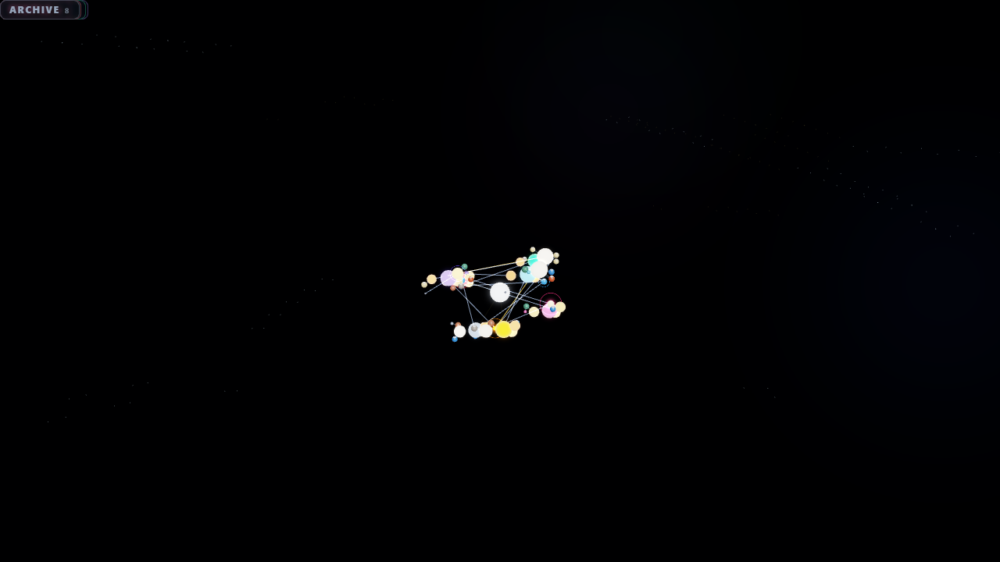

# Kosmos Oden

See how your notes connect.

Kosmos Oden turns a folder of Markdown files into a map you can explore.
Folders become galaxies. Connected notes become stars, planets, and moons.
Loose notes become asteroids. Attachments sit around the edge of the map.
Your files stay where they are.

Use it to explore a research library, find related ideas, or see where a
collection needs more work. It runs in a browser or inside Obsidian.

## Current version

**0.8.1** fixes problems with exports, folder monitoring, connection handling,
and the startup screen. The [changelog](CHANGELOG.md) lists every fix in this
update.

This is still an internal alpha. You can build and use the browser viewer and
Obsidian plugin. The separate local service, desktop installers, and automatic
maintenance of index notes are not ready for general use.

## Try it in a browser

Open `kosmos-oden-stand-alone.html` from a build of this repository.
Choose **Open Knowledge Folder**, then select the folder that holds your notes.
If that option is unavailable, choose **Open Folder Snapshot**.

You can also choose **Load Demo** to explore a sample collection first.

The HTML file contains everything the viewer needs. Once built, it works
without Obsidian, Node.js, a web server, or an internet connection. Opening
your folder does not upload, edit, move, or delete its files.

Browsers that support persistent folder access can rescan your folder while
the page is open. A folder snapshot is a single import. Import it again when
you want to see later changes.

## Use it in Obsidian

Build the project using the instructions in the [technical README](TECHNICAL_README.md).
Copy `manifest.json`, `main.js`, and `styles.css` into
`<vault>/.obsidian/plugins/kosmos-oden/`. Enable **Vault Kosmos (KRS)**, then run
**Open Vault Kosmos** from the command palette.

The view follows changes to your vault. The plugin also includes optional
tools for note formatting, agent access, and Nextcloud sync.

See the [plugin guide](docs/COMMUNITY-PLUGIN.md) for installation details.

## Explore your notes

Drag to orbit the map. Scroll or pinch to zoom. Select a body to focus on
its connections. Search for a note or use the filters to narrow the view.

**Overview**, **Focus**, **Depth**, and **Fly** give you different ways to move
around. **Chrono** shows which recorded note version was valid at a chosen
time. It uses dates and relationships in the notes. It cannot recover old
file contents that were never saved.

When an authorized agent visits notes, its trail can appear on the map.
**Traffic Heatmap** highlights recent visits. It starts off and says nothing
about the quality or truth of a note.

You can record an available traversal stream and replay it at 1x, 2x, or 5x.
Recordings stay in memory until you choose **Export session**. Each recording
holds at most 5,000 events or 2 MB. It contains traversal records, not note
bodies, prompts, or credentials.

## Export a map

**Export Graph JSON** downloads the graph for the source you are viewing.
It works with local folders, the demo, an imported graph, and a compatible
local service.

**Export Graphiti Episodes** is available after you open a local folder or
folder snapshot. It needs the note content from that source. Both exports are
created in memory and saved only when you choose the export action.

## Optional tools

The Obsidian settings separate agent connections, connection setup, note
formatting, and sync.

**Agent access.** The plugin can let an agent read an allowed view of your
notes through REST or MCP. It is disabled by default. Sensitivity settings
control what can be returned. A connection token does not grant permission
to change your notes or approve a suggestion.

**Connection setup.** Quick Connect provides configuration for supported MCP
clients. Treat copied configuration as a secret when it contains a token.
The [Agent API guide](AGENT-API.md) explains the available connections.

**Note formatting.** GKX stores structured information alongside your Markdown.
The plugin supports editable GKX Properties, timestamps, conversion previews,
backups, and reviewed changes. Older material may use the names OKF or OKF+.
GKX is the current name used by this project.

In Obsidian, timestamp maintenance starts enabled. It updates creation and
modification fields when notes change. Turn off **Stamp note creation and
modification times** in settings if you do not want those writes.

**Suggestions.** Optional enrichment can propose changes for review. A
suggestion stays pending until a person decides what to do with it. Approval
and applying the change are separate steps. An agent cannot approve its own
proposal.

**Nextcloud sync.** The plugin can sync a separately configured Nextcloud
folder over WebDAV. Sync is disabled by default and uses Obsidian Secret
Storage for the app password. Deletion propagation is also off by default.
Sync changes files when enabled, so keep your own backups.

## Work still in progress

The viewer includes a connection form for a compatible service on the same
computer. That service is separate from the Obsidian Agent API and is not
bundled with this viewer. Enter credentials in the password field, never in
the address. Connections are restricted to the local computer and redirects
are rejected.

Navigation can recognize existing index notes, often called maps of content
or MOCs. Work on ownership records, adoption previews, and automatic
maintenance is still experimental. Automatic creation and maintenance remain
unavailable and off.

A desktop shell exists in source. It still needs real service binaries,
installer testing, signing, and platform checks. A successful source build
does not make it a finished desktop release.

## More information

* [Working capabilities](docs/WIRED-CAPABILITIES.md): connected features, controls, and requirements
* [Technical README](TECHNICAL_README.md): architecture, setup, contracts, and checks
* [Changelog](CHANGELOG.md): version history and fixes
* [Build review](docs/assessments/2026-09-05-build-review.md): findings and test evidence
* [Security](SECURITY.md): reporting problems and understanding the boundaries
* [Contributing](CONTRIBUTING.md): working on the project

## Credits and license

Kosmos Oden is an independent fork and rebuild of
[Vault Kosmos](https://github.com/H4R7W16/vault-kosmos).
The [acknowledgments](ACKNOWLEDGMENTS.md) describe its origins.

Original software uses the Apache 2.0 license. Original documentation and
graphics use CC BY 4.0 where declared. Inherited materials keep their own
licenses. See [LICENSE](LICENSE) and the
[dependency notices](THIRD-PARTY-NOTICES.md) for details.
